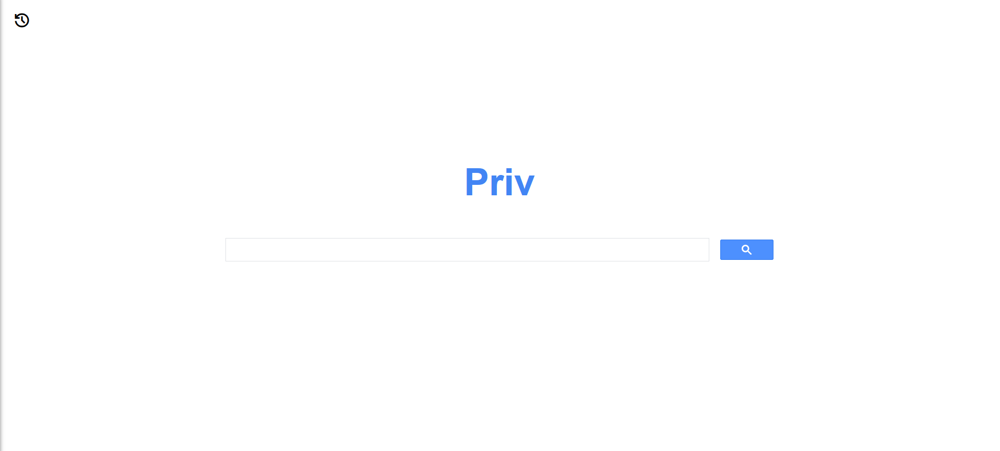
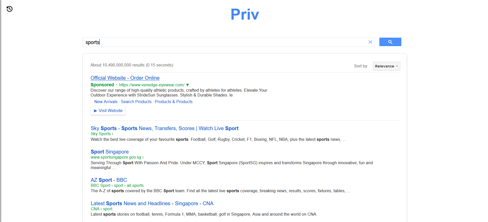
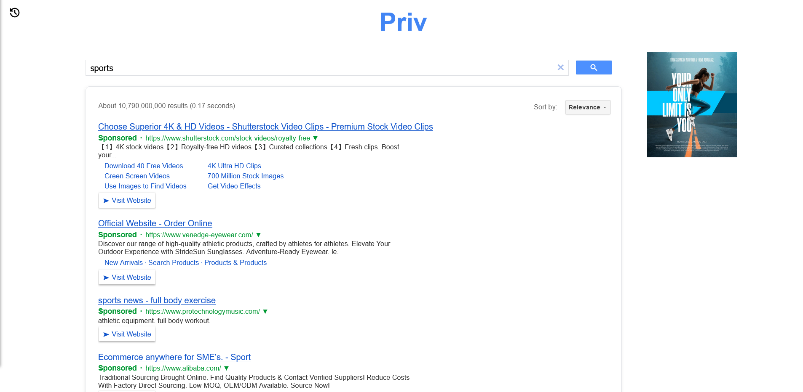
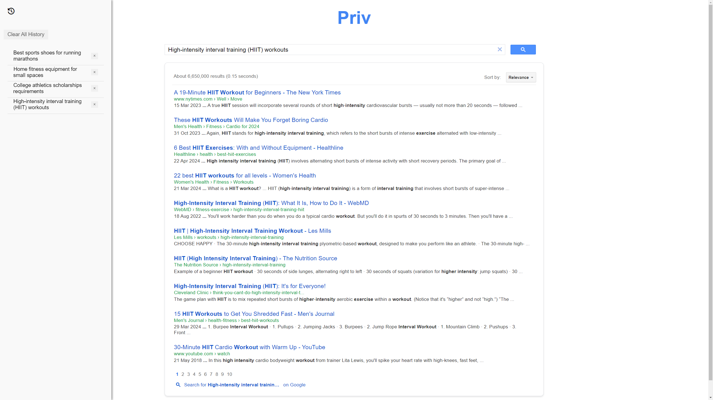
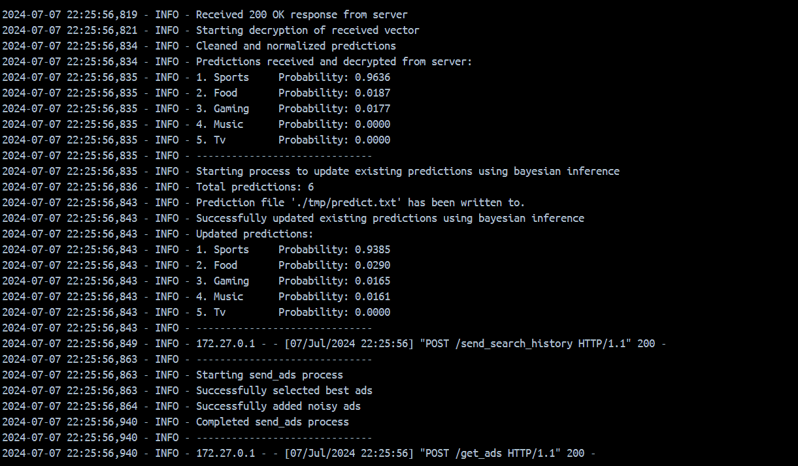

<!-- PROJECT LOGO -->
<br />

<h3 align="center">AnonymousAds</h3>

  <p align="center">
    Targeted ads without user tracking!
    <br />
  </p>
</div>

<!-- TABLE OF CONTENTS -->
<details>
  <summary>Table of Contents</summary>
  <ol>
    <li>
      <a href="#about-the-project">About The Project</a>
      <ul>
        <li><a href="#built-with">Built With</a></li>
      </ul>
    </li>
    <li><a href="#methodology">Methodology</a></li>
    <li>
      <a href="#getting-started">Getting Started</a>
      <ul>
        <li><a href="#prerequisites">Prerequisites</a></li>
        <li><a href="#installation">Installation</a></li>
      </ul>
    </li>
    <li><a href="#usage">Usage</a></li>
    <li><a href="#acknowledgments">Acknowledgments</a></li>
  </ol>
</details>

<!-- ABOUT THE PROJECT -->

## About The Project

AnonymousAds is a web application that serves targeted advertising to users, without compromising user privacy. It uses fully homomorphic encryption (FHE) and noise injection to allow for these ads to be served. For more information, you can watch our team's video. This project
is a submission to TikTok TechJam 2024. 


### Built With

- ConcreteML
- Flask
- NTLK
- Docker
- Sklearn
- Torch
- Pandas
- numpy
- requests
- shutil


<!-- METHODOLOGY -->

## Methodology

### Pre-Requisites

The `dev` container contains all files and code required to generate pre-requisites. 

1. The ML model is fitted on clear training data. 
2. The model is compiled and then used to generate `server.zip` and `client.zip` in the `dev/fhe_directory/` directory

### Protocol

Fully Homomorphic Encryption (provided by the Concrete-ML library) allows us to apply functions to encrypted data, for them to be in effect,
when decryption takes place later. This allows encryption and decryption to be entirely on the local machine, and yet allow the encrypted data
to be processed on an external machine. As a proof of concept, this project uses FHE to serve targeted advertising to end-users, while ensuring
the privacy of their search history. 

1. The `search-engine` generates public keys and sends it to the `server`.
2. The user inputs 5 search queries into the `search-engine`.
3. The search queries is processed into vector, encrypted and is sent to `server`.
4. The `server` takes this input runs the model, and sends the still encrypted predictions back to the `search-engine`.
5. The `search-engine` decrypts the predictions and updates its predictions. 
7. The `search-engine` makes a request to the `server` for ads, adding noise to the request, obfuscating the predictions.
8. The `search-engine` selects the relevant ads from this set of ads, and serves the targeted ads to the user.

<!-- GETTING STARTED -->

## Getting Started

AnonymousAds is built to run on desktops.

To get a local copy of AnonymousAds up and running follow these simple steps.

### Prerequisites

Docker desktop is required to run the application.

Download Docker at [https://www.docker.com/products/docker-desktop/](https://www.docker.com/products/docker-desktop/)

We recommend having at least 6GB of Disk Space and 4GB of RAM.

This proof of concept was tested on Windows 11 and Ubuntu. It was also tested with Firefox, Google Chrome, and Microsoft Edge. If you face any issues, please free to let us know.

### Installation

1. Clone the repo

   ```sh
   git clone https://github.com/Apzure/AnonymousAds.git
   ```
2. Open Docker desktop
3. Enter in the terminal

   ```sh
   docker compose up
   ```
4. Open up the link [http://127.0.0.1:5000](http://127.0.0.1:5000) provided in the terminal

<!-- USAGE EXAMPLES -->

## Usage

### Basic Usage
1. When the opening the link above, you will be greeted by this landing page. Enter your queries into the search bar and hit ENTER or click the search button on the right.

<!-- INSERT SCREENSHOT OF LANDING PAGE HERE -->



2. Initially, there would be no ads displayed on the page. 

<!-- INSERT SCREENSHOT OF QUERY PAGE HERE + NO ADS-->



3. Every 5 queries, the page would be automatically updated with new ads based on your search results. It would take 5-10 seconds for the ads to be updated. See [Queries and Keywords](#queries-and-keywords) for more information.

<!-- INSERT SCREENSHOT OF QUERY PAGE HERE + ADS-->



4. You can view your past queries by clicking on the history icon on the top left corner. Click on the same icon to hide your history.

<!-- INSERT SCREENSHOT OF QUERY PAGE HERE + ADS + HISTORY-->



5. You view the logs on Docker Desktop for more information. 

<!-- INSERT IMG OF DOCKER-->!



### Queries and Keywords 

As you input more queries, our search engine tracks and updates your preferences using a Bayesian update scheme. Initially, the engine makes larger adjustments to its predictions as it gathers more information. Over time, as more queries are entered, the model stabilizes, and the ads displayed become more consistent.

#### Keyword Usage
To help our machine learning model categorize your queries effectively, please include the following keywords. Your queries can contain punctuation and additional words besides the keywords. The keywords are not case-sensitive, and you can use different words with the same "stem" as the keyword. For more about stemming, see the [nltk documentation](https://www.nltk.org/howto/stem.html#unit-tests-for-the-porter-stemmer) for more about stemming.

Example: "games" shares the same stem "gam" as "gaming" which is a keyword, so "games" would be picked up by the model. 

#### Sports
sports, fitness, athletics, training, running, gear, gym, exercise, sportswear, outdoors, wellness

#### Food
food, cuisine, gourmet, organic, recipes, delivery, dining, snacks, cooking, restaurants, healthy

#### Music
music, concerts, streaming, instruments, bands, festivals, songs, albums, lessons, dj, sound

#### Gaming
gaming, consoles, accessories, esports, multiplayer, virtual, pc, development, merchandise, livestream, communities

#### TV 
tv, dramas, shows, smart, reviews, theater, cable, series, reality, channels, binge, sports, food, music, gaming, tv

### Training the model

As described in the methodology above, the `server.zip` and `client.zip` files are used to generate the public keys and stores the model for the server. If you would like to train the model yourself and generate these files, you can follow these steps:

1. Enable the `dev` container by setting `ENABLE_DEV_SERVICE=1` in the `.env` file in the root of the repo
2. Open Docker desktop
3. Enter in the terminal

   ```sh
   docker compose up
   ```
4. The `dev` container should be running on Docker Desktop, you can view the logs and track the progress of the model
5. Once the `dev` container has exited, access the files generated by the container under `dev/fhe_directory/`. You can save them in your local machine. You may delete the other two containers after this.
6. Replace the respective zip files in `search-engine/fhe` and `server/fhe`
7. Run `docker compose up` again, and the model is now the newly trained model!

## Ad Selection and Image Availability (Proof of Concept)

Current system limitations:
- Selects top 2 ads based on prediction probabilities
- 1 image per category for demonstration
- Second ad may be less relevant if searches focus on one subject

Example: Frequent "sports" searches may result in "sports" and an unrelated category as top ads.

Potential future enhancements:
1. Multiple images per category
2. Improved ad selection algorithm
3. Dynamic image database updates

Note: These limitations are expected in a proof of concept and would be addressed in a full implementation.

## Acknowledgments

We used royalty-free stock photos in our application. For more information, see [`docs/credits.txt`](docs/credit.txt) in our repo.

